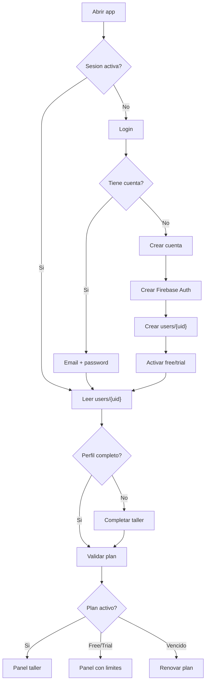
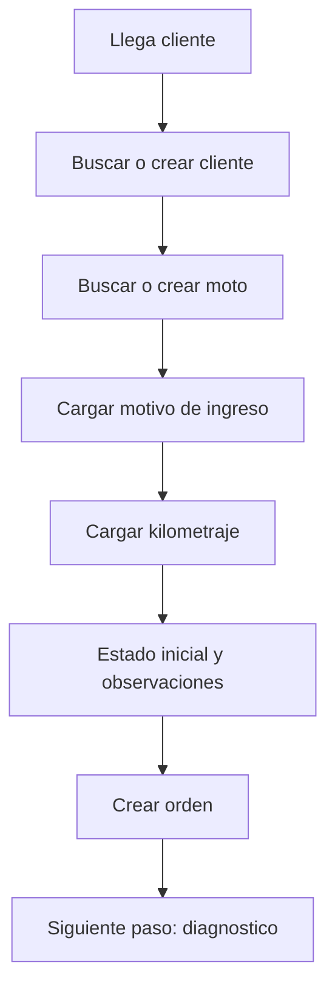
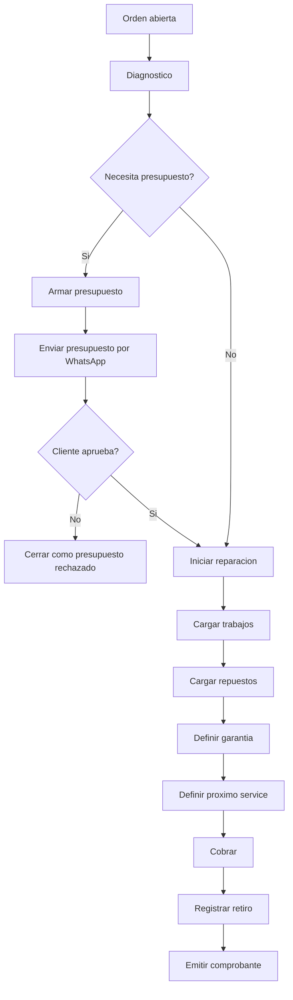
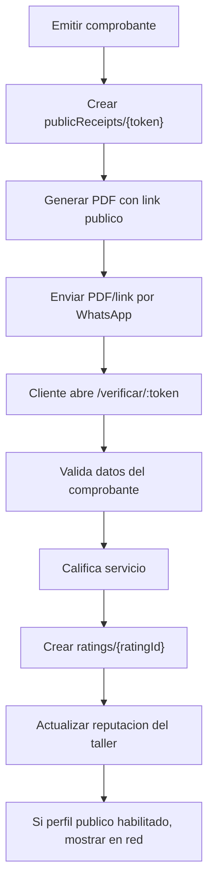

# Flujos Principales - MotoGestion

## Login y suscripcion

```mermaid
flowchart TD
  A["Abrir app"] --> B{"Sesion activa?"}
  B -->|Si| C["Leer users/{uid}"]
  B -->|No| D["Login"]
  D --> E{"Tiene cuenta?"}
  E -->|Si| F["Email + password"]
  E -->|No| G["Crear cuenta"]
  G --> H["Crear Firebase Auth"]
  H --> I["Crear users/{uid}"]
  I --> J["Activar free/trial"]
  F --> C
  J --> C
  C --> K{"Perfil completo?"}
  K -->|No| L["Completar taller"]
  K -->|Si| M["Validar plan"]
  L --> M
  M --> N{"Plan activo?"}
  N -->|Si| O["Panel taller"]
  N -->|Free/Trial| P["Panel con limites"]
  N -->|Vencido| Q["Renovar plan"]
```

## Ingreso de moto

```mermaid
flowchart TD
  A["Llega cliente"] --> B["Buscar o crear cliente"]
  B --> C["Buscar o crear moto"]
  C --> D["Cargar motivo de ingreso"]
  D --> E["Cargar kilometraje"]
  E --> F["Estado inicial y observaciones"]
  F --> G["Crear orden"]
  G --> H["Siguiente paso: diagnostico"]
```

## Trabajo del mecanico

```mermaid
flowchart TD
  A["Orden abierta"] --> B["Diagnostico"]
  B --> C{"Necesita presupuesto?"}
  C -->|Si| D["Armar presupuesto"]
  D --> E["Enviar presupuesto por WhatsApp"]
  E --> F{"Cliente aprueba?"}
  F -->|No| G["Cerrar como presupuesto rechazado"]
  F -->|Si| H["Iniciar reparacion"]
  C -->|No| H
  H --> I["Cargar trabajos"]
  I --> J["Cargar repuestos"]
  J --> K["Definir garantia"]
  K --> L["Definir proximo service"]
  L --> M["Cobrar"]
  M --> N["Registrar retiro"]
  N --> O["Emitir comprobante"]
```

## Comprobante y reputacion

```mermaid
flowchart TD
  A["Emitir comprobante"] --> B["Crear publicReceipts/{token}"]
  B --> C["Generar PDF con link publico"]
  C --> D["Enviar PDF/link por WhatsApp"]
  D --> E["Cliente abre /verificar/:token"]
  E --> F["Valida datos del comprobante"]
  F --> G["Califica servicio"]
  G --> H["Crear ratings/{ratingId}"]
  H --> I["Actualizar reputacion del taller"]
  I --> J["Si perfil publico habilitado, mostrar en red"]
```
